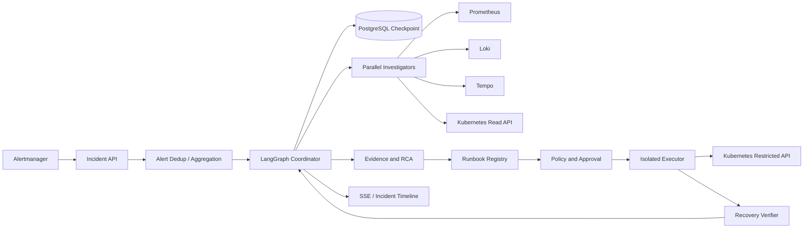
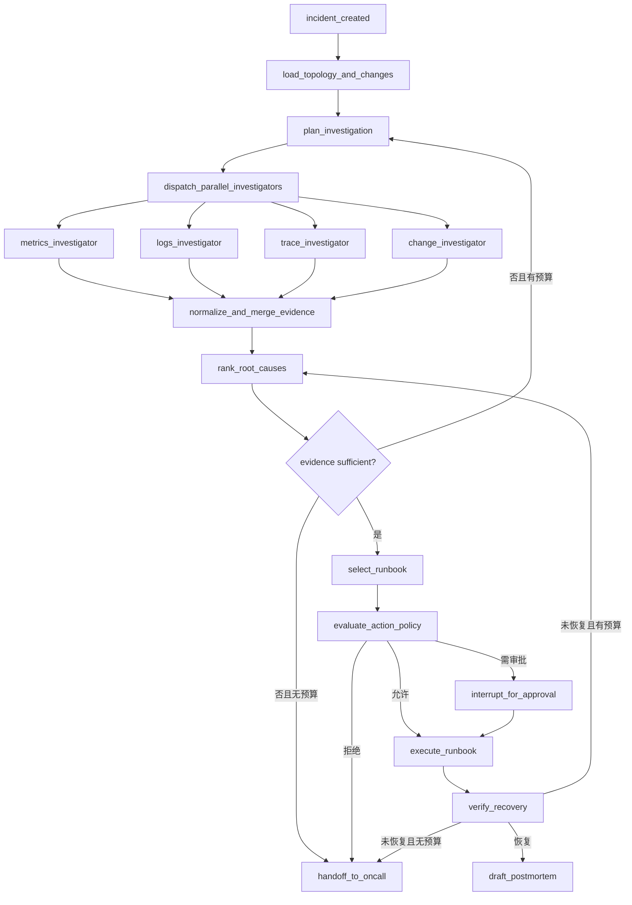

# 系统架构

## 1. 高层架构



调查平面与执行平面使用不同 ServiceAccount。调查器只有查询权限；执行器只允许调用注册动作，并将参数转换为 Kubernetes Client 的类型化调用，不接受命令字符串。

## 2. Incident Graph



LangGraph reducer 按 `evidence_id` 合并并行结果，保证节点重试不会重复追加。Coordinator 只调度和控制预算，不亲自查询全部数据源。

## 3. 核心状态与证据

```python
class IncidentState(TypedDict):
    incident_id: str
    severity: str
    affected_services: list[str]
    alert_refs: list[str]
    topology_snapshot_id: str
    investigation_plan: list[dict]
    evidence: Annotated[list[Evidence], merge_evidence_by_id]
    hypotheses: list[Hypothesis]
    investigation_round: int
    budgets: dict[str, int]
    proposed_action: dict | None
    approval: dict | None
    execution: dict | None
    verification: dict | None
    handoff_reason: str | None

class Evidence(BaseModel):
    evidence_id: UUID
    source_type: Literal["metric", "log", "trace", "deployment", "k8s"]
    source_ref: str
    observed_at: datetime
    window_start: datetime
    window_end: datetime
    query_template_id: str
    rendered_query_hash: str
    statement: str
    supports: list[str]
    contradicts: list[str]
    confidence: float
```

系统保存受限查询模板 ID 与查询哈希，原始大结果保存在短期对象存储或遥测系统，避免 checkpoint 膨胀。界面通过 `source_ref` 深链到原始数据。

## 4. 查询安全

- Agent 选择查询模板与受限参数，不能生成任意 PromQL/LogQL。
- 参数只允许已注册服务、namespace、最长 30 分钟窗口和预定义聚合。
- 日志最多返回固定行数，先聚类/计数，再按代表样例取详情。
- Trace 查询按 service、operation、status 与时间范围过滤。
- Kubernetes 只读工具只暴露 get/list deployment、pod、event 和 rollout history。

## 5. Runbook 模型

```python
class RunbookDefinition(BaseModel):
    name: Literal["restart_deployment", "scale_deployment", "rollback_deployment"]
    parameter_schema: dict
    allowed_environments: set[str]
    risk_level: Literal["low", "medium", "high"]
    requires_approval: bool
    timeout_seconds: int
    verification_policy: str
```

执行请求包含 incident、runbook version、参数、目标 resource UID、审批 ID 和幂等键。执行前重新读取资源版本，避免调查后目标已变化。动作完成只表示 API 调用成功，事件必须经过恢复验证才能关闭。

## 6. 恢复验证

每个 Runbook 绑定验证策略，例如：连续 5 分钟错误率低于阈值、P95 回到历史基线范围、Deployment available replicas 达标、无新 CrashLoopBackOff。验证器使用确定性规则输出 recovered/not_recovered/inconclusive，LLM 仅负责解释结果。

## 7. 故障处理

| 故障 | 行为 |
|------|------|
| 某遥测源不可用 | 记录 missing-source evidence；降低置信度，不伪造观察 |
| 并行节点部分失败 | 保留成功证据，按最小证据集决定重试或转人工 |
| 调查器意见冲突 | 保存支持与反证，协调器发起定向查询 |
| 查询量超限 | 工具层拒绝并返回 reason code，不自动扩大权限 |
| 审批超时 | action 过期，恢复命令不能执行 |
| Kubernetes 返回超时 | 查询资源状态和幂等执行记录，不盲目重复写入 |
| 修复后未恢复 | 将验证结果作为反证回到 RCA，预算耗尽后转人工 |

## 8. 关键决策

### 多 Agent 仅用于真正独立的数据源调查

Metrics、Logs、Trace 和 Change 具有不同工具、数据结构和专业判断，并行调查能缩短时间。根因裁决、权限与执行不通过 Agent 投票决定，而由集中证据模型和确定性策略控制。

### 不开放任意查询与命令

自由 PromQL/LogQL 容易造成昂贵查询，任意 Shell 更存在直接安全风险。模板化工具牺牲通用性，换取可测试、可限流和最小权限；这符合首版三个已知故障场景。

### 恢复验证独立于执行结果

Kubernetes API 返回成功不代表用户故障已恢复。将验证作为独立状态可以发现错误根因和无效动作，并为 MTTR 提供准确终点。
