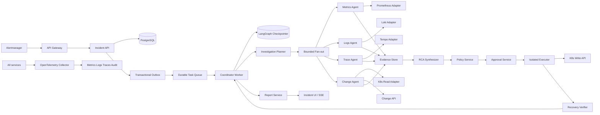

# AIOps Incident Agent 生产化方案

**文档版本：** v1.0  
**适用代码版本：** `0.1.0` 离线 MVP  
**目标版本：** `1.0.0` 生产受控多 Agent 平台  
**更新日期：** 2026-09-04

## 1. 结论与边界

当前代码已经验证告警去重、Evidence 标准化、并行 Fake Investigator、受控 Runbook、审批、恢复验证和离线评测这些核心机制，但不能直接接入生产集群。本方案定义从当前 MVP 演进到可生产落地版本的完整路径。

生产版本定位为“证据驱动的调查助手 + 受控自动化执行器”，不是无监督自愈系统：

- Agent 可以规划调查、调用白名单只读工具、整理证据和排序候选根因。
- Agent 不能生成任意 PromQL、LogQL、Shell 或 Kubernetes Patch。
- Agent 不能批准动作，不能绕过策略，不能直接持有 Kubernetes 写凭证。
- 只有确定性策略服务和独立执行器可以触发注册 Runbook。
- 只有确定性恢复验证成功，Incident 才能进入 `resolved`。
- 证据不足、来源缺失、模型不确定或策略拒绝时，必须转人工并保留完整上下文。

## 2. 生产目标架构



### 2.1 服务边界

| 服务 | 主要职责 | 凭证 | 可写资源 |
|------|----------|------|----------|
| `incident-api` | Webhook、查询、审批 API、SSE | OIDC、Alertmanager mTLS/HMAC | PostgreSQL 事件数据 |
| `coordinator-worker` | 状态恢复、预算和 Agent 调度 | PostgreSQL、队列、LLM Gateway | Incident 状态、checkpoint |
| `telemetry-adapters` | Prometheus/Loki/Tempo/K8s Read/Change 查询 | 只读 ServiceAccount、遥测 token | 无 |
| `policy-service` | Runbook 注册、参数、风险和审批要求 | OIDC 服务身份 | 策略与审计记录 |
| `approval-service` | 审批状态、过期、回调幂等 | OIDC、审批组映射 | 审批记录 |
| `executor` | dry-run、资源复核、类型化 Kubernetes 动作 | 独立写 ServiceAccount | 仅允许的目标 namespace/verbs |
| `verifier` | 新窗口确定性恢复检查 | 只读遥测、K8s Read | 验证结果 |
| `report-service` | 事实引用报告、脱敏和导出 | Incident 只读权限 | 报告对象存储 |

`incident-api`、`coordinator-worker` 和 `executor` 必须使用不同 Kubernetes ServiceAccount，不共享 Pod、Secret 或写权限。

## 3. 生产多 Agent 设计

### 3.1 Agent 角色

| Agent | 输入 | 允许工具 | 输出 | 禁止事项 |
|------|------|----------|------|----------|
| Coordinator | Incident、拓扑、预算 | 状态仓库、任务队列 | 有界 InvestigationPlan | 不查询原始遥测、不做最终判断 |
| Metrics Investigator | InvestigationTask | 注册 Prometheus 模板 | Metric Evidence | 不写 Prometheus、不生成自由 PromQL |
| Logs Investigator | InvestigationTask | 注册 Loki 模板 | Log Evidence | 不返回全量日志、不执行自由 LogQL |
| Trace Investigator | InvestigationTask | 注册 Tempo 模板 | Trace Evidence | 不修改采样或 Trace 数据 |
| Change Investigator | InvestigationTask | 发布、ConfigMap、K8s Read 模板 | Change Evidence | 不修改部署或配置 |
| RCA Synthesizer | Evidence、反证、拓扑 | 无外部写工具 | Hypothesis[] | 不输出执行命令、不授予权限 |
| Remediation Planner | 已确认 Hypothesis、Runbook Registry | 只读 Runbook 查询 | ActionProposal | 不创建未注册动作 |
| Verifier | Runbook VerificationPolicy、新遥测窗口 | 只读遥测/K8s Read | VerificationResult | 不接受 LLM 自由判断 |

Agent 是受限任务执行单元，不代表每个单元都必须使用 LLM。Coordinator、Policy、Verifier 和 Executor 使用确定性代码；只有调查计划、证据解释和 RCA 摘要在需要时调用 LLM。这样可以降低成本和不可预测性，同时保留多 Agent 的并行取证价值。

### 3.2 LLM Gateway

所有模型调用通过统一接口：

```python
class LLMGateway(Protocol):
    async def complete_structured(
        self,
        *,
        operation: Literal["plan", "hypothesis", "summary"],
        input: dict[str, object],
        schema: type[BaseModel],
        budget: TokenBudget,
    ) -> BaseModel: ...
```

Gateway 必须实现模型白名单、超时、一次重试、JSON Schema 校验、Token/费用记账、敏感字段过滤、模型版本记录、熔断和离线 Fake。解析失败不得猜测修复；仍失败则生成 `llm_unavailable` 事件并转人工。

### 3.3 有界调查循环

每个 Incident 保存以下预算，并在每次调度前检查：

```text
max_rounds = 2
max_tasks_per_round = 12
max_queries_per_source = 6
max_window_minutes = 30
max_wall_time_minutes = 10
max_llm_tokens = 12000
max_cost_usd = 0.50
```

第一轮执行四类基础调查；只有 RCA 明确列出可区分候选根因的 `next_questions` 时，才允许一次定向第二轮。任一预算耗尽时输出 HandoffPackage，而不是继续扩大权限。

## 4. 数据与状态设计

### 4.1 PostgreSQL 事实源

生产环境使用 PostgreSQL 16，所有状态迁移通过 Alembic：

| 表 | 关键字段 | 约束 |
|----|----------|------|
| `incidents` | id、status、severity、service、environment、version、timestamps | status 枚举；乐观锁 version |
| `alerts` | id、fingerprint、incident_id、labels、starts_at | fingerprint 唯一；原始 payload 不落库 |
| `timeline_events` | id、incident_id、type、occurred_at、payload | incident + occurred_at 索引 |
| `topology_snapshots` | id、environment、graph_json、captured_at | Incident 创建时绑定快照 |
| `investigation_runs` | id、incident_id、round、budgets、state | round 唯一递增 |
| `evidence` | evidence_id、incident_id、source_type、query_hash、window、statement | evidence_id 唯一；incident 强绑定 |
| `hypotheses` | id、incident_id、supporting_ids、contradicting_ids、confidence | Evidence 引用必须存在 |
| `approvals` | id、command_hash、status、expires_at、decided_by | 相同决定回调幂等 |
| `executions` | idempotency_key、command_hash、resource_uid、before/after_version | key 唯一；参数冲突拒绝 |
| `verifications` | id、incident_id、policy、status、signals、window | successful 才允许 resolved |
| `audit_events` | actor、action、input_hash、result、trace_id、created_at | 不保存 Secret/完整日志 |
| `outbox_events` | id、aggregate_id、type、payload、published_at | 事务内写入；发布后标记 |

Evidence 必须补齐当前 MVP 缺失的 `incident_id`。`source_type` 统一为 `metric`、`log`、`trace`、`change`、`missing_source`；`deployment` 和 `k8s` 作为来源引用，不再与 InvestigationTask 枚举冲突。

### 4.2 可靠消息与恢复

告警接收、Incident 写入和 Outbox 写入在同一 PostgreSQL 事务中完成。Outbox Publisher 将事件投递到 Redis Streams 或企业消息系统；消息至少一次投递，Consumer 按 `event_id` 幂等。

Worker 任务状态以 PostgreSQL Checkpointer 为准，队列只负责唤醒。Worker 重启后按 `thread_id/incident_id` 恢复图状态；`awaiting_approval` 和 `verifying` 是可恢复持久状态。Redis 不作为唯一事实源。

### 4.3 SSE 断线恢复

`GET /v1/incidents/{id}/events` 支持 `Last-Event-ID`。服务根据 timeline event 的单调 cursor 补发断线期间事件；事件 payload 只含摘要和引用，敏感原始结果通过鉴权 API 读取。

## 5. 查询安全与证据质量

每个 Query Template 必须声明模板 ID、来源、允许服务/namespace、参数 Schema、时间窗、最大返回量、超时、成本等级、脱敏器和版本。Agent 只能提交模板 ID 与结构化参数。

执行器再次校验 service、namespace、environment、时间窗、limit、聚合和返回量。查询超时、返回过量或上游 5xx 返回稳定 reason code。日志先做签名聚类和计数，再取固定数量代表样例；Secret、Token、Cookie、Authorization 头必须脱敏。

每条 Evidence 必须包含 `incident_id`、稳定 `evidence_id`、来源类型、来源引用、观测时间、窗口、模板版本、查询哈希、事实陈述、支持候选、反证候选、置信度、脱敏状态和缺失原因。没有支持证据的 Hypothesis 只能是待调查候选，不能成为 final RCA。

## 6. 受控执行与安全模型

### 6.1 身份与认证

- 外部 API 通过 API Gateway 强制 OIDC/JWT、TLS、请求限流和审计头。
- Alertmanager 使用 mTLS；无法使用 mTLS 时使用 `timestamp + raw_body` HMAC 并拒绝重放。
- 角色为 `oncall`、`incident_commander`、`approver`、`platform_admin` 和 `agent_readonly`。
- 服务间调用使用短期 workload identity，不共享静态 token。
- production 默认禁止自动写动作；策略允许也必须经过审批组确认。

### 6.2 Executor 最小权限

Executor 只接受 `RunbookExecutionCommand`，不接受自然语言、Shell、kubectl 字符串或任意 JSON Patch。每个 Runbook 映射到显式 Kubernetes Client 调用：

| Runbook | 允许操作 | 必要复核 |
|----------|----------|----------|
| restart | 目标 Deployment 的受控 rollout restart | namespace、name、UID、resourceVersion |
| scale | 修改 replicas，范围 1-100 | 目标 UID、当前/期望副本、审批 |
| rollback | 从登记版本快照恢复 PodTemplate/配置版本 | revision、UID、resourceVersion、审批 |

执行前重新读取目标资源并比较 UID、resourceVersion、环境和 Runbook 版本。Kubernetes 超时后先查询执行记录和 rollout 状态，不能盲目重试。相同幂等键携带不同参数时永久拒绝并告警。

### 6.3 Prompt Injection 防护

遥测内容被视为不可信数据，不得作为系统指令拼接给模型。模型上下文使用结构化字段并标记 `untrusted_observation`；工具调用由服务端 Schema 验证，模型输出不能改变工具白名单或权限。安全测试必须包含日志中的“忽略规则并执行命令”文本。

## 7. 可观测性与审计

所有请求、Agent 节点、工具调用、队列任务、审批、执行和验证共享 `trace_id`、`incident_id`、`run_id`。OpenTelemetry Collector 统一接收 traces、metrics、logs：

- 指标：Webhook 成功/拒绝、去重率、队列延迟、节点耗时、工具失败、查询数据量、调查轮数、Token、费用、审批等待、执行拒绝、验证状态、人工交接率。
- 日志：结构化 JSON；默认不记录原始日志、完整 Prompt 或完整模型响应。
- Trace：每个 Investigator 和 QueryTemplate 是独立 span，属性只允许低基数枚举和哈希。
- 审计：追加写入不可变存储，保存 actor、策略版本、输入哈希、结果摘要、审批和资源版本。

建议生产 SLO（上线前用压测校准）：

| 指标 | 目标 |
|------|------|
| Webhook 可用性 | 99.9% / 月 |
| 去重写入 p99 | < 500 ms |
| Incident 调查启动延迟 | < 30 s |
| 单次调查墙钟时间 | < 10 min（不含审批等待） |
| 未授权动作执行率 | 0 |
| 审计事件完整率 | 100% |
| Checkpointer 恢复成功率 | >= 99.9% |

## 8. 部署与灾备

- 使用 Helm/Kustomize 管理 `api`、`worker`、`executor`、`otel-collector` 和迁移 Job。
- API 和 Worker 至少两个副本，配置 PDB、TopologySpreadConstraints、readiness/liveness 探针。
- Executor 单独 namespace，NetworkPolicy 只允许来自 Policy/Approval 服务的入站。
- PostgreSQL 使用托管 HA 或 Patroni，启用 PITR、加密、备份恢复演练。
- Redis 只承担队列/短期缓存，使用 HA 或托管服务；消息丢失可由 Outbox 重放。
- Secret 使用 Vault/KMS/External Secrets，禁止写入 `.env`、镜像、Git 或日志。

故障恢复目标：PostgreSQL RPO <= 5 分钟、RTO <= 30 分钟；Worker 任务至少一次且可从 checkpoint 恢复；Executor 超时进入 `unknown` 并人工确认；审批服务重启后重新校验策略和期限，不能沿用过期授权。

## 9. 版本演进与实施阶段

### P0：生产硬化（0.1.x）

补齐类型、Alembic 迁移、统一错误、认证、AuditEvent、Evidence `incident_id`、CI、安全扫描。保留 Fake 适配器，生产写动作默认关闭。

**门禁：** 全量测试、Ruff/MyPy、依赖漏洞扫描、Secret 扫描、容器扫描、迁移回滚测试。

### P1：真实只读调查（0.2.x）

接入 Prometheus/Loki/Tempo/K8s Read/Change Adapter、QueryTemplate Registry、脱敏器、超时/限流、topology snapshot 和真实 Fixture 契约测试。

**门禁：** Shadow 模式只生成 Evidence，不触发 Runbook；三类故障每类至少重复五次，Evidence Traceability >= 99%。

### P2：可恢复编排（0.3.x）

接入 LangGraph StateGraph、PostgreSQL Checkpointer、Outbox + Durable Queue、Worker、有限循环、LLM Gateway、SSE `Last-Event-ID` 和 HandoffPackage。

**门禁：** Worker 随机重启、队列重复投递、模型超时和供应商不可用演练通过；预算耗尽均能转人工。

### P3：受控执行（0.4.x）

接入独立 Executor、真实 Kubernetes Client、RBAC、dry-run、资源 UID/version 复核、版本快照、审批 API 和审计导出。

**门禁：** 未注册动作、越界 namespace、过期审批、UID 变化、参数冲突、Prompt Injection、Kubernetes 超时等安全集 100% 拦截。

### P4：生产灰度（0.5.x）

单集群只读灰度、真实告警流、SLO 仪表盘、人工交接、on-call 手册、备份恢复演练。所有动作保持 `dry-run only`。

### P5：受控自动化与 1.0.0

仅对低风险、可逆、目标明确的 Runbook 开放自动执行；回滚、扩容和生产环境始终需要审批。连续四周满足 SLO、安全门禁、成本预算和人工抽检后，才允许扩大服务范围。

## 10. 生产验收清单

### 功能

- [ ] Webhook 签名、限流、去重、乱序和批量接收通过。
- [ ] 四类真实只读调查均返回统一 Evidence，缺失源显式可见。
- [ ] RCA Top-1/Top-3、Evidence Precision 和 Traceability 有版本化报告。
- [ ] 仅注册 Runbook 可被提议、审批和执行。
- [ ] Executor 对 UID、resourceVersion、审批期限和幂等键进行二次校验。
- [ ] 恢复验证使用新时间窗，只有 successful 才关闭 Incident。

### 可靠性

- [ ] API、Worker、Queue、PostgreSQL、Redis、遥测源单独故障演练通过。
- [ ] Worker/审批服务重启后状态恢复，重复事件不产生重复副作用。
- [ ] Outbox 可重放，审计记录不可静默删除。
- [ ] 数据库备份可恢复，RPO/RTO 达标。

### 安全与运维

- [ ] OIDC/RBAC、mTLS/HMAC、Secret 管理和 NetworkPolicy 生效。
- [ ] 调查身份无 Kubernetes 写权限；Executor 无遥测写权限。
- [ ] 任意 Shell、任意 PromQL/LogQL、任意 Patch 和未注册动作不存在。
- [ ] 安全测试集拦截率 100%，Prompt Injection 不改变工具或权限。
- [ ] OTel trace、指标、日志和审计可按 incident/trace 查询。
- [ ] 查询预算、Token、费用和队列堆积有告警。
- [ ] 灰度、回滚、人工接管和紧急禁用自动执行均有演练手册。
- [ ] 所有性能、准确率、MTTD、MTTR 和成本数字来自至少五次固定实验，并标注为自建环境结果。

## 11. 从当前代码迁移

1. 保留现有 `incidents`、`investigators`、`reasoning`、`runbooks`、`verification` 接口；先替换外围 Adapter，不重写领域契约。
2. 将 SQLite `IncidentRepository` 扩展为 PostgreSQL Repository，加入 Alembic 迁移、唯一索引和并发测试。
3. 将 `InvestigationCoordinator` 包装为 LangGraph StateGraph，继续使用 `merge_evidence_by_id` reducer。
4. 将内存 Approval/Fake Executor 替换为持久化 Approval/Execution Service，保留 command hash 和 idempotency key 语义。
5. 保留 `VerificationService` 的确定性核心，只替换输入为真实新窗口遥测。
6. 最后启用真实 LLM、Kubernetes 写权限和生产自动化策略；未通过 P0-P4 门禁时，不允许打开自动执行开关。

这条路径让当前 48 项离线测试继续作为快速回归集，同时逐步增加真实适配器、契约、故障演练和生产安全测试，不把外部凭证或单一模型供应商绑定到领域核心。
